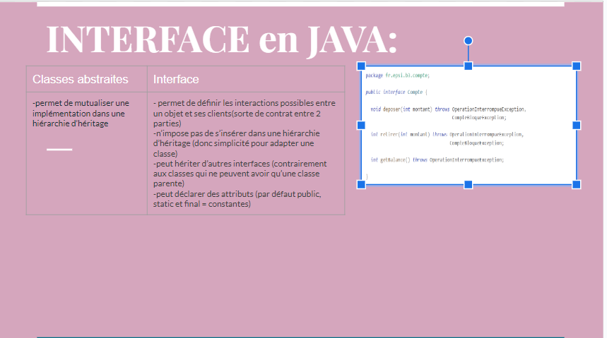

##BASES PACKAGES
pour faire des packages on utilise souvent com
Main ou App : c 'est le point d'entrée de l application

##INTERFACE
pour la classe write, le nom de l'interface devient: writable
pour read : nom interface devient: Readable
pour BankCard : nom interface devient : CardBankable
ON GARDE UN NOM EN -able POUR LES INTERFACES

La portée est toujours public et abstract (qu'on le mette ou pas dans le code)
Heritage: interface peut avoir plusieurs parents, donc peut implements plusieurs interfaces  (différent d'une classe abstraite qui ne peut extends qu'une classe parente)

On ne fait pas de getter et setter car pas de private
mais on peut mettre une variable protected et final si on veut garder la variable utilisable seulement dans un dossier

Une interface a accès à une autre interface meme d'un package différent
il faut implémenter la manière dont ces méthodes vont etre utilisées

##LES CLASSES ABSTRAITES

L'intérêt principal de définir une classe comme abstraite va être justement de fournir un cadre plus strict lorsqu'ils vont utiliser notre code en les forçant à définir certaines méthodes et etc. 

Une classe abstraite est une classe qui ne peut pas être directement instanciée. Une classe abstraite encapsule des attributs et méthodes qui peuvent être utilisés par les instances des classes qui en héritent.
elle ne peut pas être instanciée, mais ses sous-classes non abstraites le peuvent. une classe abstraite est déclarée avec le modificateur abstract.

Une classe abstraite est généralement utilisée pour construire des classes similaires. Elles auront toutes une implémentation en commun, celle de la classe abstraite. Une interface est généralement utilisée pour définir des capacités (le « contrat »), même si les classes n'ont pas grand chose en commun.
C'est la bonne manière de faire pour qu'une classe mère ait plusieurs classes enfants.
La classe abstraite va nous permettre de définir plusieurs choses
On est obligé d'utiliser cette méthode, ça maintient la solidité du code pour les développeurs.
La méthode abstraite n'est pas implémentée, pas de constructeur pour les classes abstraites CAR elle ne peut pas être instanciée dc il serait inutile

Les 3 règles des classes abstraites:
-doit avoir minimum une méthode abstraite
-n'a pas de getter ni de setter: puisque c'est abstrait, il n'y a rien à renvoyer
-oblige ses enfants à utiliser/implémenter les méthodes abstraites (n'a pas le choix)

